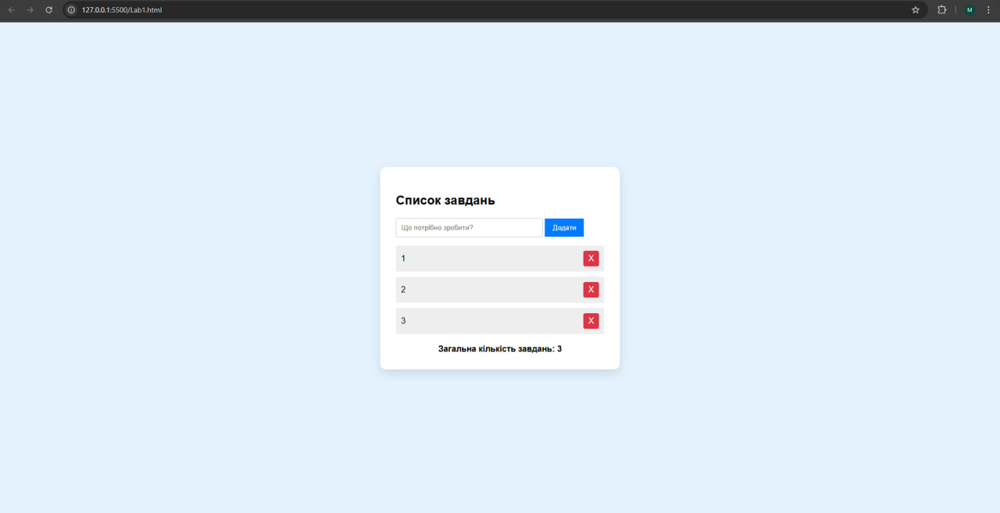
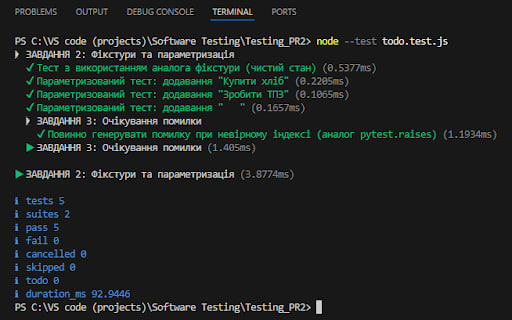

# 📝 Вебзастосунок To-Do List

**To-Do List** — це навчальний вебзастосунок, розроблений для управління списком завдань через зручний графічний інтерфейс. Проєкт демонструє використання базових принципів об'єктно-орієнтованого програмування на JavaScript, а також реалізацію просунутого автоматизованого тестування логіки застосунку.

## 🚀 Можливості застосунку
- Додавання завдань (*з валідацією на порожні рядки*).
- Візуальне відображення списку у браузері.
- Видалення завдань за індексом.
- Автоматичний підрахунок активних завдань.
- Повне покриття логіки модульними тестами (включаючи перевірку помилок).

## 💻 Скріншоти роботи
> **Інтерфейс застосунку в браузері:**

> **Результат виконання модульних тестів логіки застосунку в консолі:**

## ⚙️ Технологічний стек
1. **JavaScript (ES6)** — мова розробки.
2. **HTML5 / CSS3** — графічний інтерфейс користувача.
3. **Node.js** — середовище виконання та тестування (модуль `node:test`).
4. **Git / GitHub** — система контролю версій.

## 📖 Інструкція із запуску
Щоб запустити проєкт локально та перевірити його працездатність, виконайте наступні команди:

    # Клонування репозиторію
    git clone https://github.com/weakbtw/Testing_PR2.git

    # Перехід у папку проєкту
    cd Testing_PR2

    # Запуск тестів логіки
    node --test todo.test.js

## 🤝 Як долучитися
Бажаєте допомогти проєкту? Чудово! Будь ласка, ознайомтеся з нашими правилами у файлі [CONTRIBUTING.md](./CONTRIBUTING.md) перед тим, як вносити зміни.

---
**Автор:** Малий А.В., студент групи ІПЗ22-1.